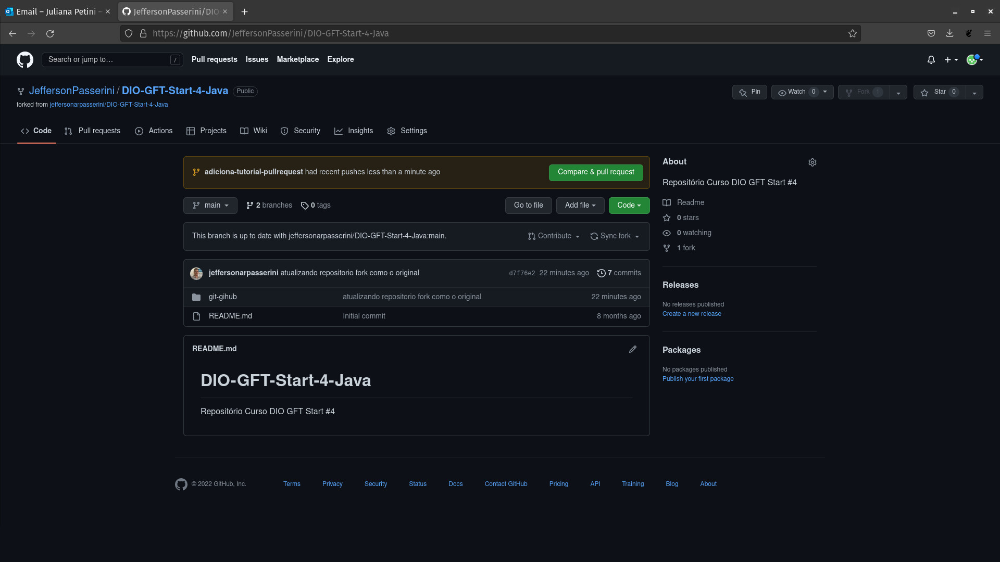
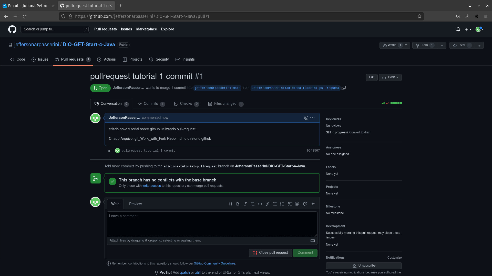
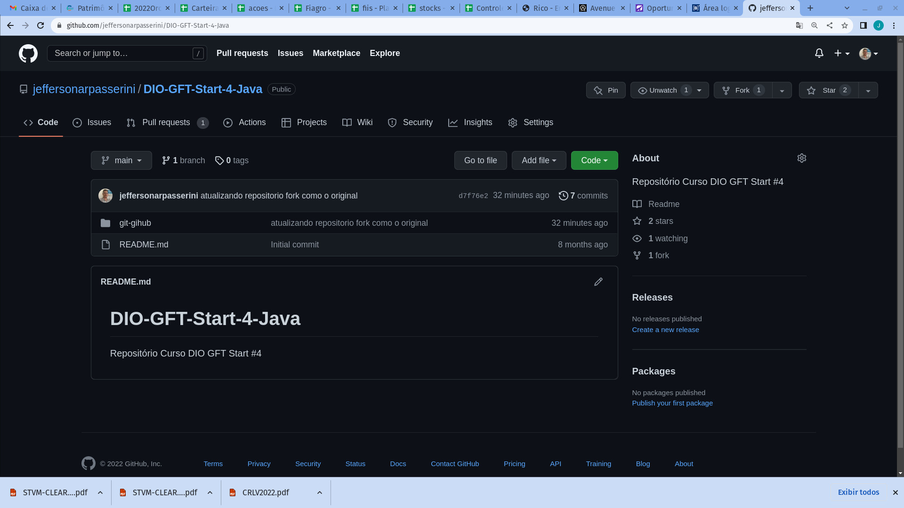

# Trabalhando com repositorio forkado

1. Criar uma branch para as suas atualizações de modo a gerar um pull-request para que o autor original possar verificar o seu código.

$ git checkout -b adiciona-nova-atualizacao

Faça suas atualizações nos arquivos dentro na nova branch

Após faça:

$ git add .
$ git commit - m 'altera.... '

e faça um push para esse repositorio criado 

$ git push origin adiciona-nova-atualizacao

# Criando Pull-Request

O git hub já percebe que foi criado uma atualizacao no seu fork (copia) e sugere para você criar um pull-request para atualizar o projeto original. Para isso clique no botão verde indicado na interface do github.com.

Uma vez gerado o pull-request o github lhe direciona ao projeto original

No repositorio do projeto original irá aparecer na aba Pull Requests o numero (1) indicando que existe um novo pull request a ser analisado.

Abrindo no repositorio original o proprietario pode analisar o pull request, trocar mensagens com o autor que sugeriu a atualizacao e commitar ou não o projeto original

